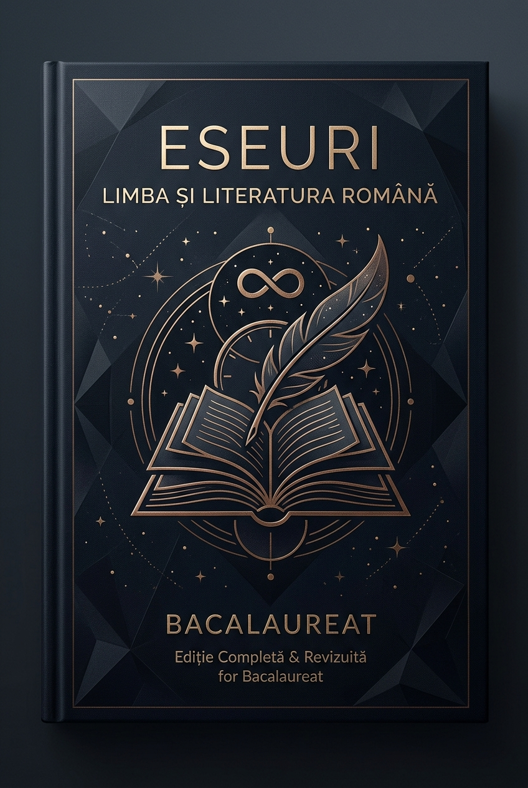

# 📖 Carte Română Eseuri — Ediție Digitală Bacalaureat

[](https://o1tean.github.io/carte-romana-eseuri/)
[](https://github.com/o1tean/carte-romana-eseuri/raw/main/Carte_Romana_Eseuri_AppleBooks.epub)
[](https://github.com/o1tean/carte-romana-eseuri/raw/main/Carte_Romana_Eseuri_GoogleDocs.docx)
[](https://github.com/o1tean/carte-romana-eseuri/raw/main/Carte_Romana_Eseuri_Original.pdf)

> O ediție digitală modernă, exhaustivă și riguros redactată pentru pregătirea probei scrise de **Limba și Literatura Română** la examenul de Bacalaureat. Include toate eseurile structurate conform cerințelor oficiale, sinteze, scheme de caracterizare și **peste 50 de benzi desenate originale** pentru memorie vizuală.

---

<p align="center">
  
</p>

---

## 🌐 Web App Interactiv (GitHub Pages)

Poți răsfoi întregul volum direct în browser cu un design inspirat din sistemul grafic Apple (Dark / Light Mode, fonturi SF Pro & New York Serif):

🔗 **[https://o1tean.github.io/carte-romana-eseuri/](https://o1tean.github.io/carte-romana-eseuri/)**

### Caracteristici Web Edition:
* **Filtrare pe Genuri Literare**: Proză, Roman, Dramaturgie, Poezie.
* **Căutare Live**: Găsire instantă de termeni critici, citate și concepte de teorie literară.
* **Galerie Vizuală**: Ilustrații comic integrate cu zoom tactil (Lightbox).
* **Marcaje de Pagină Originale**: Fidelitate totală față de numerotarea ghidului tipărit (160 de pagini).

---

## 📥 Formate Disponibile pentru Descărcare

| Format | Fișier | Descriere & Utilizare |
| :--- | :--- | :--- |
| 🍏 **Apple Books (.epub)** | [`Carte_Romana_Eseuri_AppleBooks.epub`](./Carte_Romana_Eseuri_AppleBooks.epub) | Optimizat pentru Apple Books pe macOS, iOS și iPadOS. Include XML valid EPUB3, fonturi native, copertă high-res și 58 de ilustrații integrate inline. |
| 📄 **Google Docs / Word (.docx)** | [`Carte_Romana_Eseuri_GoogleDocs.docx`](./Carte_Romana_Eseuri_GoogleDocs.docx) | Format gata de editare sau încărcare în Google Drive. Respectă paginarea originală, stiluri tipografice și diacritice standard românești (`ș`, `ț`, `ă`, `î`, `â`). |
| 📕 **PDF Original Scanat** | [`Carte_Romana_Eseuri_Original.pdf`](./Carte_Romana_Eseuri_Original.pdf) | Scanarea inițială completă (94 de planșe compuse, 160 de pagini originale). |

---

## 📚 Opere Canonice Incluse

1. **Moara cu noroc** — Ioan Slavici *(Nuvelă psihologică realistă)*
2. **Ion** — Liviu Rebreanu *(Roman realist-obiectiv, modern)*
3. **Povestea lui Harap-Alb** — Ion Creangă *(Basm cult)*
4. **Enigma Otiliei** — George Călinescu *(Roman balzacian / realist-mitic)*
5. **O scrisoare pierdută** — I. L. Caragiale *(Comedie de moravuri)*
6. **Ultima noapte de dragoste, întâia noapte de război** — Camil Petrescu *(Roman modern psihologic)*
7. **Moromeții** — Marin Preda *(Roman postbelic al deruralizării)*
8. **Baltagul** — Mihail Sadoveanu *(Roman mitic-polițist tradițional)*
9. **Iona** — Marin Sorescu *(Teatru parabolic neoavangardist)*
10. **Riga Crypto și lapona Enigel** — Ion Barbu *(Baladă modernist-ermetică)*
11. **Leoaica tânără, iubirea** — Nichita Stănescu *(Poezie neomodernistă)*
12. **Plumb** — George Bacovia *(Poezie simbolistă)*
13. **Testament** — Tudor Arghezi *(Ars poetica modernistă)*
14. **În grădina Ghetsimani** — Vasile Voiculescu *(Poezie tradiționalist-religioasă)*
15. **Eu nu strivesc corola de minuni a lumii** — Lucian Blaga *(Ars poetica expresionistă)*
16. **Luceafărul** — Mihai Eminescu *(Poem romantic filozofic)*
17. **Floare albastră** — Mihai Eminescu *(Poezie romantică elegiacă)*
18. **Ochiul babei / Metodologia Eseului** — Structura oficială Subiectul III

---

## 🛠️ Cum deschizi pe Mac

Pentru a citi ediția EPUB pe Mac în aplicația nativă Books:
```bash
open -a Books Carte_Romana_Eseuri_AppleBooks.epub
```

Pentru a deschide pagina web local:
```bash
open index.html
```
